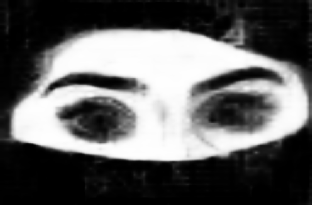
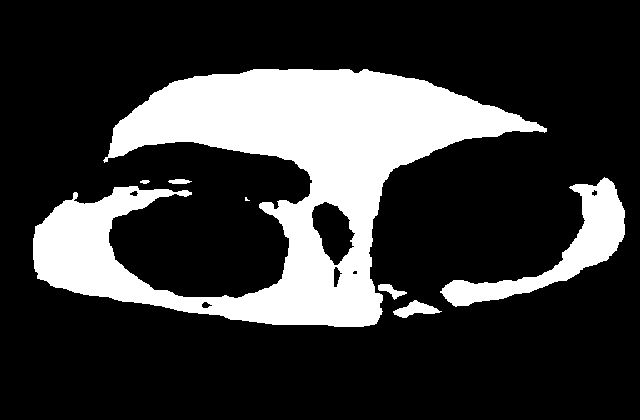
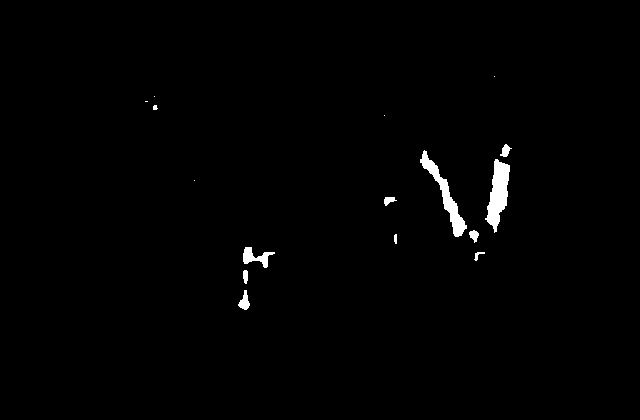
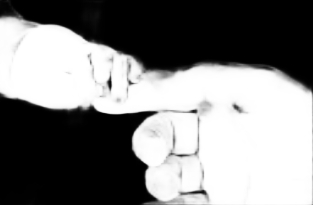
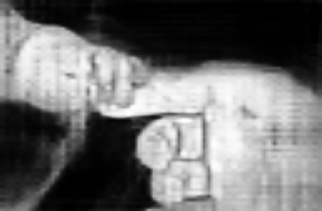

# Implementations for skin detection

- **cheref**: threshold based approach
- **deeplab/deeplab_Xception65**: neural network for semantic segmentation specially trained for the task of skin detection; it uses the Xception65 backbone resulting in roughly 42M parameters
- **deeplab/deeplab_MobileNetV2**: neural network for semantic segmentation specially trained for the task of skin detection; it uses the MobileNetV2 backbone resulting in roughly 2M parameters

<!-- TODO add corresponding publication (cinc2021) -->

**If using this approach for your research please cite:**

> tba

## How to use

- For deeplab
  - you'll find the instructions in each subfolder
  - at the moment both implementations are meant to be run within a docker container where a folder with images is given to the container and then processed, i.e. each image is segmented
- For cheref: check the documentation

## Comparison of the implemented deeplab models

<table>
  <tr>
    <td align="center">Original frame</td>
    <td align="center" colspan="2">deeplab_Xception65</td>
    <td align="center" colspan="2">deeplab_MobileNetV2</td>
  </tr>
  <tr>
    <td align="center"></td>
    <td align="center">Segmented frame probability</td>
    <td align="center">Segmented frame mask ("-t 0.95")</td>
    <td align="center">Segmented frame probability</td>
    <td align="center">Segmented frame mask ("-t 0.95")</td>
  </tr>
  <tr>
    <td align="center"></img></td>
    <td align="center"></img></td>
    <td align="center"></img></td>
    <td align="center"></img></td>
    <td align="center"></img></td>
  </tr>
  <tr>
    <td align="center"></img></td>
    <td align="center"></img></td>
    <td align="center"></img></td>
    <td align="center"></img></td>
    <td align="center"></img></td>
  </tr>
  <tr>
    <td align="center"></img></td>
    <td align="center"></img></td>
    <td align="center"></img></td>
    <td align="center"></img></td>
    <td align="center"></img></td>
  </tr>
  <tr>
    <td align="center"></img></td>
    <td align="center"></img></td>
    <td align="center"></img></td>
    <td align="center"></img></td>
    <td align="center"></img></td>
  </tr>
  <tr>
    <td align="center"></img></td>
    <td align="center"></img></td>
    <td align="center"></img></td>
    <td align="center"></img></td>
    <td align="center"></img></td>
  </tr>
  <tr>
    <td align="center"></img></td>
    <td align="center"></img></td>
    <td align="center"></img></td>
    <td align="center"></img></td>
    <td align="center"></img></td>
  </tr>
  <tr>
    <td align="center"></img></td>
    <td align="center"></img></td>
    <td align="center"></img></td>
    <td align="center"></img></td>
    <td align="center"></img></td>
  </tr>
  <tr>
    <td align="center"></img></td>
    <td align="center"></img></td>
    <td align="center"></img></td>
    <td align="center"></img></td>
    <td align="center"></img></td>
  </tr>
  <tr>
    <td align="center"></img></td>
    <td align="center"></img></td>
    <td align="center"></img></td>
    <td align="center"></img></td>
    <td align="center"></img></td>
  </tr>
  <tr>
    <td align="center"></img></td>
    <td align="center"></img></td>
    <td align="center"></img></td>
    <td align="center"></img></td>
    <td align="center"></img></td>
  </tr>
  <tr>
    <td align="center"></img></td>
    <td align="center"></img></td>
    <td align="center"></img></td>
    <td align="center"></img></td>
    <td align="center"></img></td>
  </tr>
  <tr>
    <td align="center"></img></td>
    <td align="center"></img></td>
    <td align="center"></img></td>
    <td align="center"></img></td>
    <td align="center"></img></td>
  </tr>
</table>
