# Instructions to run deeplab with MobileNetV2 backbone for skin detection

- You need to have docker installed on your system
- We implemented this approach using a GPU Titan RTX (24GB) but it has about 2M parameters and also runs on a much smaller GPU and even a CPU
- The deeplab implementation is based on the original repository of deeplab: <https://github.com/luyanger1799/Amazing-Semantic-Segmentation>
- Respect the license specifications of the original implementation of deeplab

<!-- TODO add corresponding publication (cinc2021) -->

**If using this approach for your research please cite:**

> tba

## How to use

We simplified the implementation so that it is easy to use. If you want to use this skin detection approach for your video(s) (regarding iPPG) you first have to create a directory with a specific structure. For further information, see the instructions below.

### Steps to use this repository with your dataset

- Create the docker container with the dockerfile within this folder:

  ```shell
  $ cd ippgtoolbox/detection/skin/deeplab/deeplab_MobileNetV2
  $ docker build -t ippg-toolbox-deeplab-mnv2 .
  ```

- Create a directory containing the frames to process:

  - If you want to process a single folder use the following directory structure:

  ```
  📦/absolute/path/to/record/folder/containing/recording/frames
  ┣ 📜frame_name_0.png
  ┣ 📜frame_name_1.png
  ┣ ...
  ```

  - If you want to process a whole dataset use the following directory structure:

  ```
  📦/absolute/path/to/folder/containing/recordings
  ┣ 📂folder_name_00
  ┃ ┣ 📜frame_name_0.png
  ┃ ┣ 📜frame_name_1.png
  ┃ ┣ ...
  ┣ 📂folder_name_01
  ┃ ┣ 📜frame_name_0.png
  ┃ ┣ 📜frame_name_1.png
  ┃ ┣ ...
  ```

  - Notes:
    - Frames can be in .jpg or .png format
    - Frame names must be in utf-8 format

- Run deeplab on your dataset:

  - Be sure to execute the following commands from within this directory:

    ```shell
    $ cd ippgtoolbox/detection/skin/deeplab/deeplab_MobileNetV2
    ```

  - ... with a single folder containing the recorded frames:

    - Bash command to use (be sure to execute it from within this directory):

    ```shell
    $ bash run_deeplab_on_single_record.sh \
      -s /absolute/path/to/record/folder/containing/recording/frames \
      -d /absolute/path/to/destination/folder/to/save/segmentation/results \
      -r 500x1000 \
      -t 0.5
    ```

  - ... with multiple folders each containing the frames of one recording:

    - Bash command to use (be sure to execute it from within this directory):

    ```shell
    $ bash run_deeplab_on_multiple_records.sh \
      -s /absolute/path/to/folder/containing/recordings \
      -d /absolute/path/to/destination/folder/to/save/segmentation/results \
      -r 500x1000 \
      -t 0.5
    ```

  - Options:

  ```shell
  -r WIDTHxHEIGHT # dimension of the original frames that are to be segmented with deeplab (and later resized to WIDTHxHEIGHT)
  -t 0.5 # apply a threshold onto the probabilities, i.e. the network output; should be float between (0.0, 1.0); if ignored, i.e. not specified, or None the raw network output is saved
  ```

  - Notes:

    - If you saved the probabilities (i.e. option "-t" not specified or "-t None") you need to apply a threshold between 0 and 255 to create a final skin mask
    - We recommend using a high threshold (e.g. "-t 0.95"). This way high sensitivity and precision can be achieved and also hairy skin is excluded.
    - Deeplab need the input to be resized to 512x512 pixels. Therefore the segmented frames must be resized to their original size afterwords. For this, opencv linear interpolation is used.
    - When using this approach to extract skin from facial video recordings we recommend using a face detection beforehand. This way the region of interest can be cropped and deeplab delivers even better results. Additionally, fine objects like glasses can be detected.
    - In the destination path you'll find the segmentation results like this:

      - When running on a single recording:

      ```
      📦/absolute/path/to/destination/folder/to/save/segmentation/results
      ┣ 📜frame_name_0_segm.png
      ┣ 📜frame_name_1_segm.png
      ┣ ...
      ```

      - When running on multiple recordings:

      ```
      📦/absolute/path/to/destination/folder/to/save/segmentation/results
      ┣ 📂folder_name_00
      ┃ ┣ 📜frame_name_0_segm.png
      ┃ ┣ 📜frame_name_1_segm.png
      ┃ ┣ ...
      ┣ ...
      ```

## How to (quick)test

- To test if all is setup (Docker, Repository, etc.) correctly run:

```shell
$ bash ./test/test_run_deeplab_on_single_record.sh
```

- or

```shell
$ bash ./test/test_run_deeplab_on_multiple_records.sh
```

## What it does

- See some exemplary segmentations below:

|                            Original frame                             | Segmented frame probability (option "-t" unspecified or "-t None") |            Segmented frame mask (option "-t 0.95")            |
| :-------------------------------------------------------------------: | :----------------------------------------------------------------: | :-----------------------------------------------------------: |
| 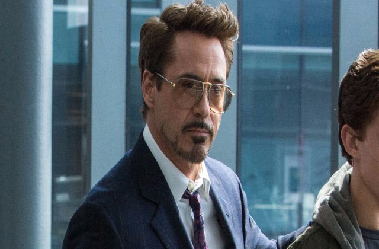  |   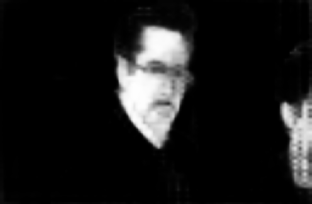    | 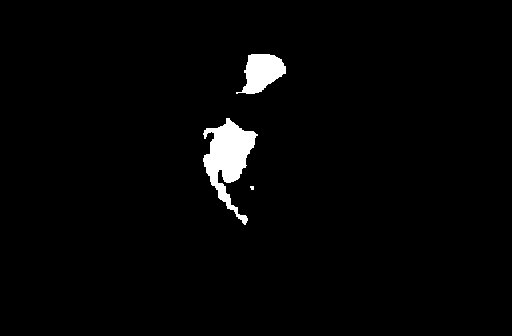  |
| 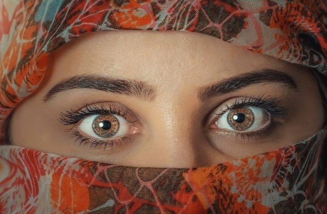  |   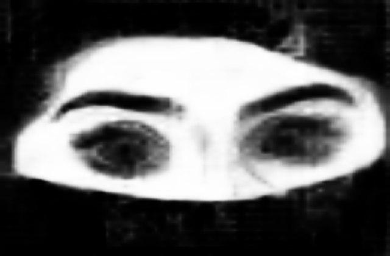    | 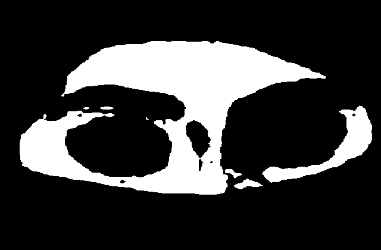  |
| 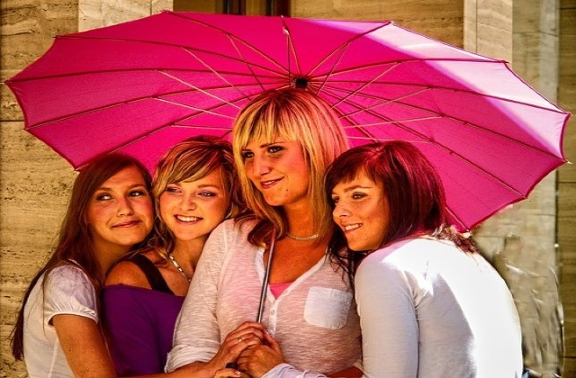  |   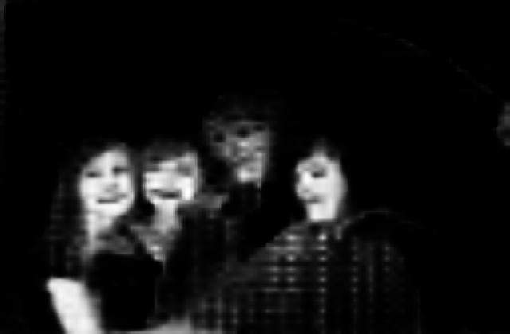    | 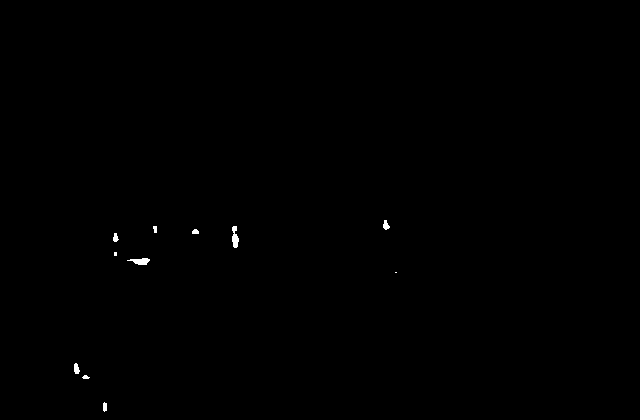  |
|   |   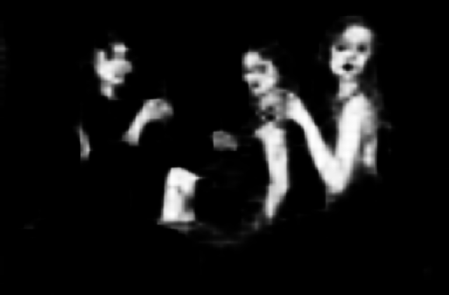    | 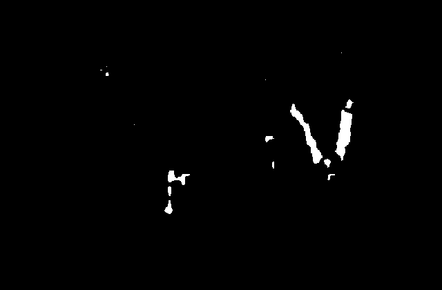  |
| 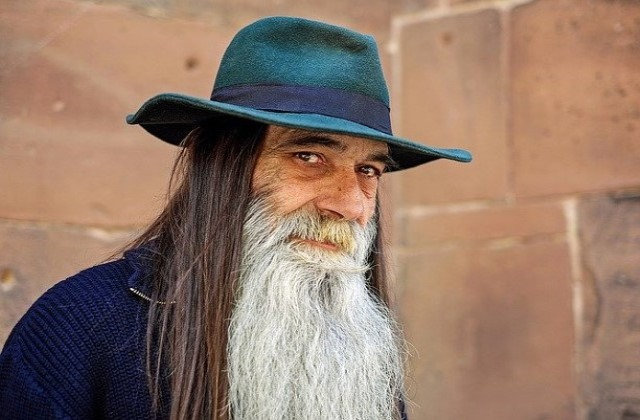  |   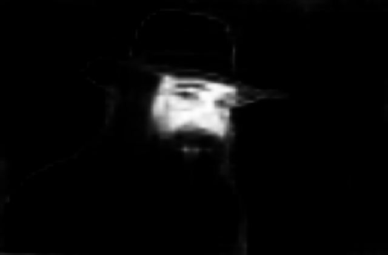    | 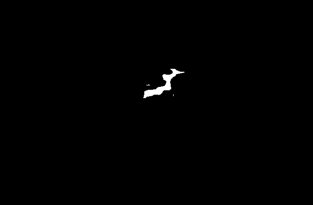  |
|   |   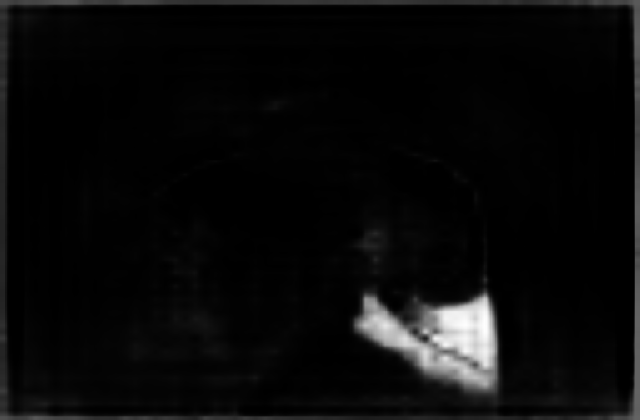    | 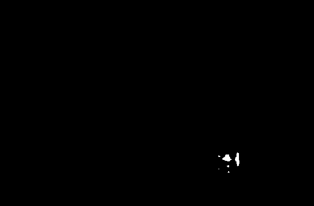  |
|   |   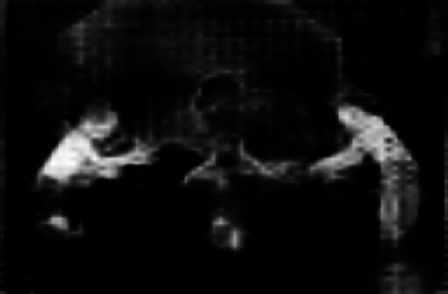    |   |
| 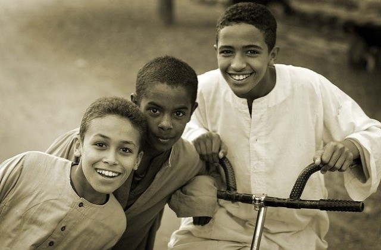  |   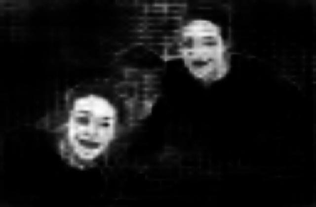    | 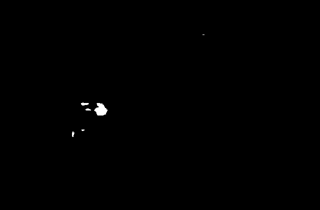  |
| 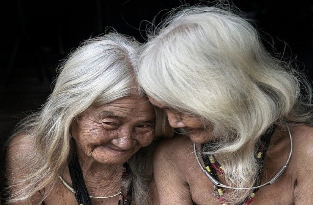  |   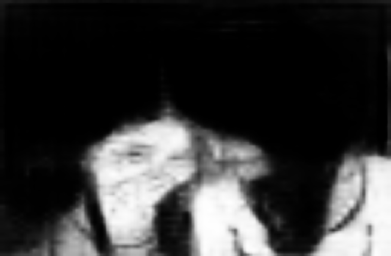    | 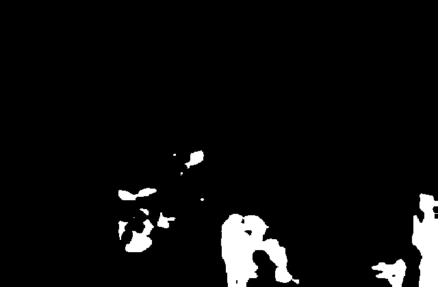  |
| 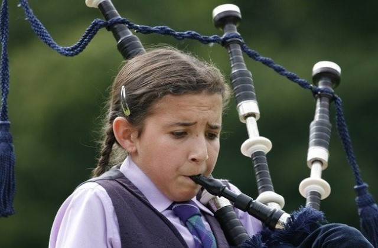  |   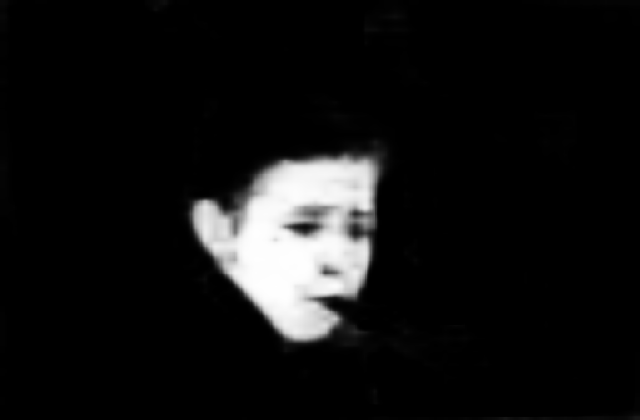    | 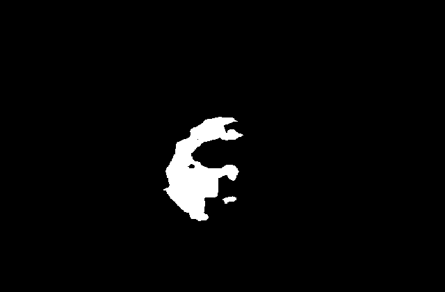  |
|  |   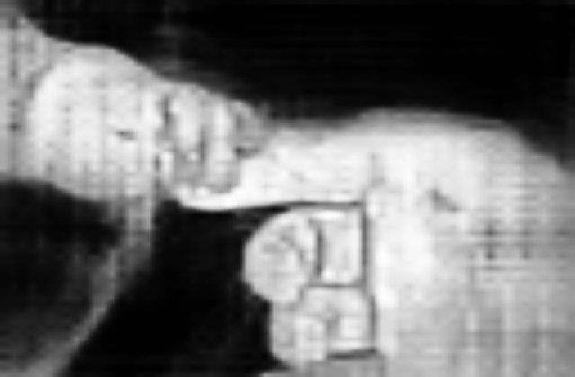   | 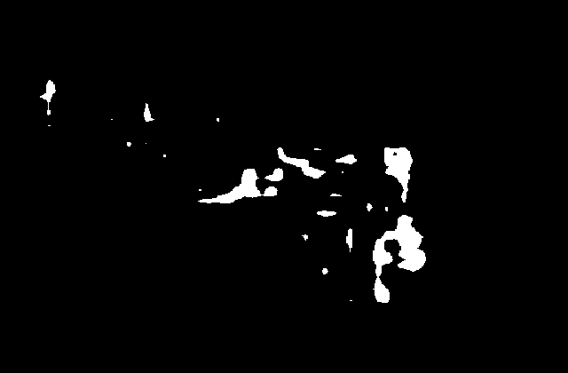 |
| 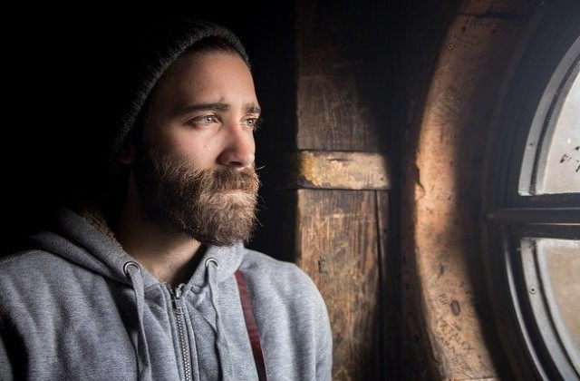 |   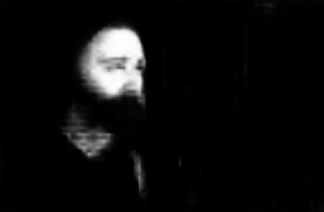   | 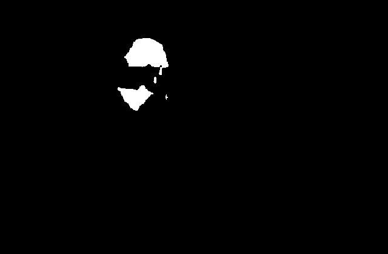 |
